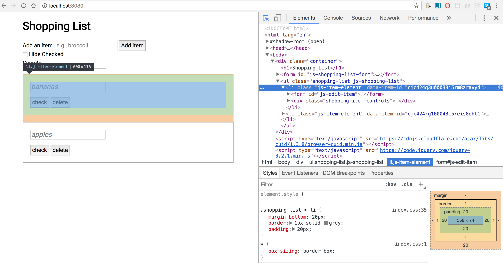

# Namespacing
We've learned that **scopes** control where variables are held, how long they exist, and the nuances to how they can be visible or inaccessible. Namespacing is essentially the practice of logically grouping variables into a labeled scope. 

Take this simple example:

```javascript
const Utils = {
  MAX_RECORDS: 1000,
  copy: function() {},
  validate: function() {},
  purge: function() {}
};
```

The four items above could have been declared in the global scope as a constant and three function expressions. Instead, we're architecturally deciding that they're all related properties and belong grouped together in a simple object.

Going beyond a simple object, the modules you created in the last exercise are actually a form of namespacing -- our `store` is a function with its own scope that was immediately invoked and then returned an object that provides limited access into that scope. This object could be called a namespace as all the attributes and methods it exposes are grouped together.

### Unique Ids

When we left our Shopping List app on Friday, we were managing items in our store's array by tracking the index location. This is serviceable when we're only dealing with data in memory, but becomes unmanageable when that data is persisted elsewhere. 

Think of Twitter: when you post a tweet, it needs to exist long after you've closed your browser window (well, that may be debatable!). When you add the tweet, you actually contact a server somewhere that will store it in a database (i.e. persistent storage). That database has no concept of your array in memory and what index it was in, since millions of other users on their browsers and phones have their own arrays with the conflicting index values. 

Enter unique identifiers. It's a common practice to assign individual data objects with a uniquely generated id, so we can move them around -- even between separate systems -- and keep track of them. Using the [cuid library](https://github.com/ericelliott/cuid) to performantly generate unique ids, we've tweaked the Shopping List app to generate one with every new item created and record that id in the DOM (instead of the array index value) to later identify the item in our store after a user interacts with it in the DOM.

Open the Shopping List app in your browser and then inspect the item element. You'll see a unique string of letters and numbers in the `data-item-id` attribute of the `<li>`:



You can see the implementation of using the cuid library when creating new shopping items inside `addItemToShoppingList`:

```javascript
function addItemToShoppingList(itemName) {
  store.items.push({ 
    id: cuid(), 
    name: itemName, 
    checked: false 
  });
}
```

We also can easily grab the id from the DOM whenever we need to identify what the user clicked:

```javascript
function getItemIdFromElement(item) {
  // `item` is the passed in event.target
  return $(item)
    .closest('.js-item-element')
    .data('item-id');
}
```

### Exercise

Our Shopping List has been built with a lot of standalone functions and global variables. Let's refactor it to use our modules as well as utilize a more object oriented approach.

**IMPORTANT:** You **must** complete the exercises in [Project Structure and Modules](modules.md) before starting these. 

Commit often!

#### 1. Item factory and validator

*Objective:* Build an Item module that contains functions to validate and create items.

- In `Item.js`, declare a `validateName` function which takes a `name`. Throw a TypeError if `name` doesn't exist with the message: "Name does not exist."
  - We'll run this validator any time we create an item or update its name to prevent items having blank names.
- In `Item.js`, declare a `create` function which will be a Factory function. It should take a `name` parameter.
- The function should return a new item object with the following attributes:
  - `id` - invoke `cuid()` to create a unique id
  - `name` - the value of parameter `name`
  - `checked` - defaults to `false`
- Return both `validateName` and `create` functions in your IIFE return object. These are now public methods.
- Test your module!
  - Inside `index.js`, inside the DOM ready function, add the following:
  ```javascript
  const itemNames = [ '', 'apples', 'pears' ];
  itemNames.forEach(name => {
    try {
      Item.validateName(name);
      store.items.push(Item.create(name));
    } catch(error) {
      console.log('Cannot add item: ' + error.message);
    }
  });
  shoppingList.render();
  ```
  - Here, we setup an array of three names - one blank, the other two valid
  - We then run a function for each name in the array that uses try/catch to validate the name and then create an item with it
  - Assuming you wrote your `Item` functions correctly, you should see one error in the log and two shopping items in your DOM.
  - Delete the test once you've seen it work.

#### 2. Update shoppingList to use the Item.create method

*Objective:* Wire up our Item methods to be used by our Shopping List module.

- Inside `shoppingList.js`, we're going to use our awesome new `Item` module.
- Modify the `addItemToShoppingList` function:
  - Open a try/catch block
  - Inside the try block, use `Item.validateName` to validate the input, `Item.create` to create an item, and push the result to `store.items`
  - Then run `render()`
  - Inside the catch block, just log out 'Cannot add item: {error.message}' for now (ideally you would display errors on the DOM)
- ESLint cleanliness: Notice we're no longer using the `cuid` library inside `shoppingList`, but we are using it in the `Item` module. Change your global definition at the top of `shoppingList` to reflect this and you should no longer have a red underline on `Item`
- Test it! 
  - Your shopping list app in the web browser should be working as before, except now it won't add blank items and organizationally you're using functions in a different module to your event handler.

#### 3. Update store to create, update, delete items

*Objective:* Put all store-related functions currently in the Shopping List module into the Store module (appropriately namespaced!)

- Let's add methods directly to our `store` to handle related operations. In most cases, we're replacing the excess logic in our `shoppingList` handlers. For practice, we recommend you write the functions from scratch and resist copy/pasting:
- Inside `store.js`, make a `findById` method which accept an `id` parameter, then uses Array method `.find()` to return the specific item from `store.items`
- Inside `store.js`, make an `addItem` method, which accepts a `name` parameter. Use a try/catch block and the `Item` module to validate the name and create the item, then push it to `this.items`.
- Make a `findAndToggleChecked` method, which accepts an `id`, then uses `this.findById()` to fetch the item and toggle its `checked` attribute
- Make a `findAndUpdateName` method, which accepts `id` and `newName` parameters. Use a try/catch to first validate the name and then use `findById()` to fetch the item and update its name. Inside catch, log out 'Cannot update name: {error.message}'
- Make a `findAndDelete` method, which accepts an `id`, and then removes the item from `this.items`.  (HINT: You can use array method `.filter()` or a combination of `.findIndex()` and `.splice()`.)
- Add all of these new functions to the IIFE's return object. These are all public methods.
- Test it! 
  - Load up your app and open the console, then type:
  ```javascript
  store.addItem('bananas');
  shoppingList.render();
  ```
  - Did bananas appear in the DOM? 
  - Manually grab the id of the first store item in the console: `store.items[0].id` and send that `id` into `store.findAndDelete`. Run `shoppingList.render()` - did it disappear from the DOM?

#### 4. Update shoppingList to use the new store methods

*Objective:* Update our Shopping List event listeners to use our namespaced store methods, and remove any of the now obsolete store-modification functions from Shopping List

- As before, update the `shoppingList` handlers to use the appropriate `store` methods and then remove the redundant methods in `shoppingList`.
  - Remove `toggleCheckedForListItem` and update `handleItemCheckClicked` to use `store.findAndToggleChecked`
  - Remove `deleteListItem` and update `handleDeleteItemClicked` to use `store.findAndDelete`
  - Remove `editListItemName` and update `handleEditShoppingItemSubmit` to use `store.findAndUpdateName`
- Test that your app still works as expected.

#### 5. Do final modifications to the store and shoppingList

*Objective:* Move all remaining store functions out of Shopping List and into the Store namespace, and wire up the event listeners to use the new namespaced functions.

- Let's finish our store refactoring by moving the remaining store-related functions out of `shoppingList`:
  - Make a method in `store` called `toggleCheckedFilter` which toggles `this.hideCheckedItems` prop
  - Make another `store` method called `setSearchTerm` which changes `this.searchTerm` to the first argument passed in
  - Remove `toggleCheckedItemsFilter` and `setSearchTerm` methods from `shoppingList`
  - Update the `handleToggleFilterClick` and `handleShoppingListSearch` to use the new store methods
  - Test that your app still works as expected!

That was a lot of refactoring, but worth it! Let's recap the concepts applied:

* Reduced the app to three global variables by using modules
  * This reduces chances of bugs and naming conflicts
* Grouped logical functions to their namespaces by separating store-related functions from templating and event handler functions

