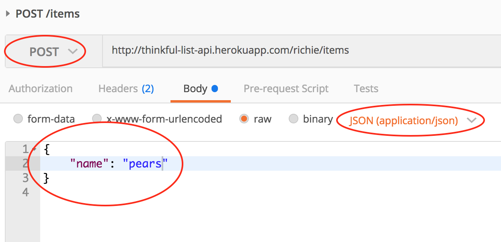
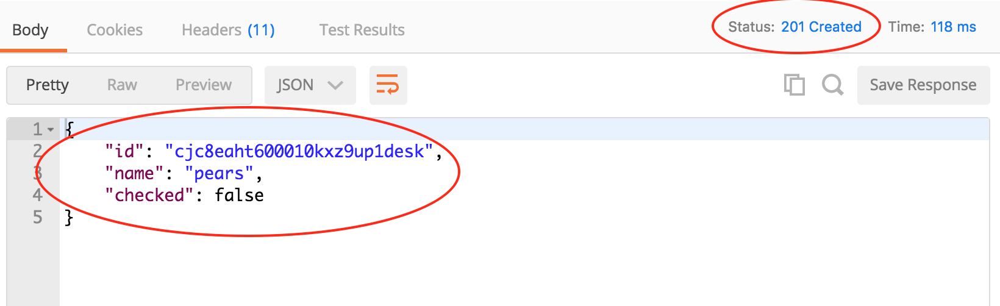

# Working with RESTful APIs

We've practiced fetching and displaying data with a few public APIs. As you've already noticed using Youtube and Github APIs, the endpoints can vary and require reviewing documentation to understand what responses you will get.

A dominant choice in attempts to standardize web APIs came with the architectural pattern known as REST (REpresentational State Transfer). You're going to dig much deeper into REST during the backend part of the course, but for right now, we're going to cover the basics to implement our Shopping List app to use a backend API server for storing and retrieving our items.

### CRUD and Resources

A vast majority of applications built require persistent storage of data to be useful. Our Shopping List loses all the items you've added once you close/refresh your tab, for example. Using data in an application can very often be boiled down to four core operations: Create, Read, Update, and Delete, or CRUD. 

Think of the world's most popular web sites and applications. Social media, utility, or blog, every user action is either creating, reading, updating, or deleting data. Write a post, like a tweet, comment on a blog, you're *creating* a new record of that activity. Open your Instagram feed and you're *reading* from many datasets to populate the page. Edit a prior post and you're *updating*, and so on.

When building with REST, we identify our represented resources. In Twitter, this may be a 'tweet', a 'star', a 'user'. Think nouns. Then we create our endpoint hierarchy around the represented resources, mapping each CRUD operation to a standard endpoint structure. For our Shopping List, our main resource is the Item. When we want to interact with the resource, we access the endpoint representing it either as a singular "document" or plural "collection":

```
==============================================================
| HTTP Method | Endpoint      | Description                  | 
|-------------------------------------------------------------
| GET         | /items        | Fetch all items              |
| GET         | /items/[id]   | Fetch one item               |
| POST        | /items        | Create item                  |
| PATCH       | /items/[id]   | Update (modifies) one item   |
| PUT         | /items/[id]   | Updates (replaces) one item  |
| DELETE      | /items/[id]   | Delete one item              |
--------------------------------------------------------------
```

For example if our API lived at `http://api.example.com` and we wanted to fetch all shopping list items, we would run an ajax request against `http://api.example.com/items`.  If we want to fetch the single item with id `judhf69fs028`, we request against `http://api.example.com/items/judhf69fs028`.

### Verbs

Above, we list several [HTTP Methods](https://developer.mozilla.org/en-US/docs/Web/HTTP/Methods). These are part of the web HTTP standards and are there to make the intentions clear of the requester.  Every AJAX request you make uses an HTTP method. Up until now, you've only been using the GET method, which is intended only for requests that READ information (no modifying). Notice that you can access the exact same endpoint (e.g. `/items`) with different HTTP methods and communicate an entirely different request.

### The Request Body

Since we've only used the GET request so far, we haven't needed to cover request bodies. HTTP requests are comprised of request **headers** and a request **body**.  Like an object, HTTP headers just contain a bunch of key-value pairs, but it's here where we send information like what data type we accept and send (e.g. HTML, JSON, XML, etc.), authorization credentials, etc.  When we make requests that create or update data using methods like POST, PUT, and PATCH, we will typically send a **body** with the request that contains our data.  The body can be in many formats, but we're only using JSON in our Shopping List.

### Beyond getJSON

So far, we've used a single jQuery method to make AJAX requests with `getJSON()`. This method is really just a shorthand for the [jQuery .ajax() method](https://api.jquery.com/jquery.ajax/). The `.ajax()` method allows the full flexibility of making requests with other HTTP methods and varying our data types. Check out below how a `getJSON()` call looks compared to its full version in `.ajax()`:

```javascript
// With getJSON()
$.getJSON('http://example.api.com/videos', { part: 'snippet' }, (data) => {
  console.log(data)
});

// With ajax()
$.ajax({
  url: 'http://example.api.com/videos',
  method: 'GET',
  dataType: 'json',
  data: { part: 'snippet' },
  success: (data) => {
    console.log(data)
  }
});
```

As you can see, there's more code to write with `.ajax()` but you can also customize the request.  Note, the `.ajax()` method accepts an object as its first argument, and this is where we set all our options. 

Let's look at making a POST request, where we're going to send data for the creation of an imaginary new blog:

```javascript
const blogData = JSON.stringify({
  title: "Because I'm Batman",
  author: 'Bruce Wayne',
  content: 'No one will ever guess my secret identity. Haha!'  
});

$.ajax({
  url: 'http://example.api.com/blogs',
  method: 'POST',
  dataType: 'json',
  contentType: 'application/json',
  data: blogData,
  success: (response) => {
    console.log(response);
  } 
}) 
```

First, we build our blob of data to include in our **request body**, and manually convert from an object to JSON string using `JSON.stringify()`. Then we make our AJAX request. We must include `contentType: 'application/json'` (based on [MIME Media Type standards](https://www.ietf.org/rfc/rfc4627.txt) to indicate in our request that we're **sending** JSON data).  The `dataType: 'json'` is only an indicator that we accept **receipt** of JSON. 

Our `data` key contains the stringified JSON. **IMPORTANT!** Notice that `data` is used differently than in our GET request. In the GET request, data is converted into the query string in our request's url. (e.g. `{ part: 'snippet' }` is converted to `?part=snippet` and appended to the URL.)  In the POST request, the content in `data` is going into the request body. This may seem strange, but it's a choice made by the jQuery library because GET requests cannot contain request bodies and POST requests often don't use query strings. 

### Friendly neighborhood Postman

Download [Postman](https://www.getpostman.com/apps). We could get along without it yesterday because we were only making GET requests. With Postman, we can send practice requests with all the other HTTP methods.

Open Postman, and try making a GET request to `https://thinkful-list-api.herokuapp.com/ei-student/items`. You should receive a [200 OK response](https://httpstatuses.com/200) and an empty array (or some test data if other students have reached here before you!).  Now try changing the method to POST in the dropdown in the top-left and hit Send.  You should receive a [400 Bad Request response](https://httpstatuses.com/400) with a message on why your request wasn't accepted. 



You need to send a request body in JSON format that contains a "name" key and some value.  Click on the "Body" tab, the "raw" radio button, then "application/json" in the dropdown.  In the editor, type in the JSON object below.  (Remember, JSON *requires* that the object key be enclosed in double quotation marks.)

```json
{
  "name": "apples"
}
```

Resending the request should give you a [201 Created response](https://httpstatuses.com/201) and the response body will contain the full shopping list item object, complete with a newly generated unique id.



This walkthrough was to demonstrate the usefulness of an API debugging tool like Postman when you're building requests and examining responses.  A forewarning: It's important to always test an API inside your app first making an AJAX request and not rely entirely on Postman.  Many API servers treat browser requests with special security scrutiny. 

### Exercise

Let's take what we've learned in our practice with APIs and today's reading to convert our Shopping List to use a backend API and persistently store our data. 

Start from the `store-solution` branch on your organization's repo
* Clone the Shopping List repo to a new folder:
  - `git clone https://github.com/[your-thinkful-org]/shopping-list-week-2.git shopping-list-api-day`
* Move into the project directory, then you will need to checkout to the `store-solution` branch
  - `git checkout store-solution`
* From this branch, we're going to create a new branch. This is where you will work on today's exercises:
  - `git checkout -b api`
* Create a new repo in the Cohort Organization `'api-day-[your-names]'` then set the origin url to your new repo:
  - `git remote set-url origin [your repo address]`
  - `git push -u origin api`

Carefully review the docs for our [Thinkful List JSON API](https://thinkful-list-api.herokuapp.com).

#### 1. Test an AJAX call to our API
- It's a good practice to simply start off making sure you can make an AJAX request and get an expected API server response.
- Go into the `index.js` and add this to the bottom:
  ```javascript
  $.getJSON('https://thinkful-list-api.herokuapp.com/ei-student/items', (response) => {
    console.log('api response:', response);
  });
  ```
- You should get an empty array or some old data in the console. If you get a red error message, carefully check your syntax and the error message and debug until you're able to make a successful AJAX call. Call in your Instructor/TA if you can't resolve!
- Once tested, delete this code.

#### 2. Create an API module

*Objective:* Create a new module to handle all the API calls your application will make. These will all be async functions responsible only for returning responses.

- Create a new `api.js` file and as before, make an IIFE that is captured by a global `api` variable. 
- In your `index.html`, link in the `api.js` script, making sure to do it before your `index.js`
- Inside the IIFE, declare a `BASE_URL` constant containing `https://thinkful-list-api.herokuapp.com/[yourname]`. (Replace [yourname] with your own -- the API will keep all items under this name separate from others.) 
- Inside the IIFE, make a `getItems` function that accepts a `callback` parameter
- Inside `getItems`, let's just send a test string back to the `callback` as if it had received some data from an API: `callback('api module works!');`
- Return an object from your IIFE, and expose your `getItems` function so it's available in your global `api` object
- Test it!
  - Inside `index.js`, add the following:
  ```javascript
  api.getItems(function(data) {
    console.log(data);
  });

  console.log(api.BASE_URL);
  ```
  - Open the app in your browser and open the console
  - You should see `'api module works!'` as the first line and `undefined` as the second. This proves your API module works, `getItems()` is an exposed method, and `BASE_URL` is private

#### 2. Write the getItems() method

*Objective*: This method will GET request on `/items` and return the response in the callback.

- Instead of just sending a test message into the callback, we're going to make an AJAX request and send the response back. 
- Inside `getItems()` make a `.getJSON()` GET request to the url of `{BASE_URL}/items` and provide the `callback` as the second argument.
- Now refresh your app and instead of logging the test message, the console should log an empty array.
- Delete this test once you're sure it works.

#### 3. Write the createItem() method

*Objective*: This method will POST request on `/items`, sending JSON in the request body, and return the response in the callback.

- Make a `createItem` method that accepts `name` and `callback` parameters
- Expose the `createItem` method in your returned object at the bottom of the IIFE
- Inside `createItem`, declare a `newItem` variable and assign it to a new object with a name key equal to the `name` value passed in. Then wrap that object in `JSON.stringify()`. This is the data we will send into our POST request.
- Next, call `$.ajax()`, sending in an object as the first argument with the following data:
  - `url` should be `{BASE_URL}/items`
  - `method` should be `'POST'`
  - `contentType` should be `'application/json'`
  - `data` should equal our `newItem` stringified JSON object
  - `success` should point to our `callback`
- Test it!
  - In `index.js`, add the following:
  ```javascript
  api.createItem('pears', (newItem) => {
    api.getItems((items) => {
      console.log(items);
    });
  });
  ```
  - Notice we're performing two asyncronous functions sequentially. First we create an item, then we fetch all items and log it out.
  - You should see an array of items including the created item. Every time you refresh the page, you'll create a new item so you might end up with quite a few pears!
  - Delete this test code when you're sure it works.

#### 4. Fetch the items and add them to the store

*Objective*: Use the API `getItems()` method to fetch data, place it in the store, and re-render the page.

- It's time to use our API data for our Shopping List instead of starting blank every time.
- Bear in mind, we're soon going to obsolete our `Item` module. Validation and unique id creation is performed on the server, so we're going to get an `item` object from the server and put it directly into our store.
- Let's simplify our `store.addItem` method. Remove all the current logic and change the signature to accept only an `item` parameter. Then just push the `item` to `this.items`.
- In `index.js`, first remove any code that creates test data in the `store` if it still exists.
- In `index.js`, inside the DOM ready function, add the lines:
  ```javascript
  api.getItems((items) => {
    items.forEach((item) => store.addItem(item));
    shoppingList.render();
  });
  ```
  - So when the DOM is ready, we're fetching all our items, we're iterating through the response and running `store.addItem` on each, then we re-run our `render`.
  - If all's working you should see some of the test items you made now displayed in the DOM.

#### 5. Connect the Add Item event listener to our API

*Objective*: Modify the event listener for adding shopping items so that it first calls `createItem()` on the API module, then places the response item in the store, then re-renders

- Inside `shoppingList.js`, inside `handleNewItemSubmit`, we're going to add a call to our API before we add to our local store.
- Try this yourself for 15 mins before continuing.
- ...
- ...
- ...
- Here's the code you should have inserted in the appropriate place:
```javascript
api.createItem(newItemName, (newItem) => {
  store.addItem(newItem);
  render();
});
```
- Test it!
  - Try adding an item normally in your app. Notice a slight delay now when you click "Add" as the app needs to contact a server and wait for a response before making the change to the view.
  - Try adding an item without entering a name. Nothing should happen. Open the console and you should see a Bad Request error appearing. Open the Network tab and click on the request. You can look at the response to see the specific error message from the server.
  - Ideally, we would have errors appear in the DOM to give the user feedback. Let's not worry about that yet.

#### 6. Write the updateItem() API method

*Objective*: Create an API method that takes in the item id and an object containing key-values intended to be updated, which makes a PATCH request to `/items/[id]` with the JSON request body

- Inside `api.js`, add an `updateItem` method that accepts `id`, `updateData`, and `callback` parameters and expose it in our object at the bottom of the IIFE
- Make an `.ajax` call with the following options:
  - `url` should be `{BASE_URL}/items/{id}`
  - `method` should be `PATCH`
  - `contentType` is `'application/json'`
  - `data` is a JSON stringified version of `updateData`
  - `success` is our `callback`
- Test it!
  - Inside `index.js`, add in:
  ```javascript
  api.getItems((items) => {
    const item = items[0];

    api.updateItem(item.id, { name: 'foobar' }, () => {
      console.log('updated!');
    });
  });
  ```
  - If the request was well formed, you will get a 200 OK response and the callback will run and print `'updated!'`.
  - You can verify the item's name changed as expected by using Postman to fetch the item directly from the API. (Or refresh your browser and the updated item should be there.)
  - Try changing the `checked` prop too. Try sending in an invalid prop. The API should send you a Bad Request response.
  - Delete the test code when done.

#### 7. Simplify the store update methods

*Objective*: Create a single `findAndUpdate` store method which takes in an `id` and an `newData` object containing new key/value pairs to merge into the current store object. (This will obsolete the separate store methods for changing `checked` and `name`, as well as the `Item` module.)

- Let's remove both `findAndToggleChecked` and `findAndUpdateName` from the `store`
- We're going to create a consolidated `findAndUpdate` method which merges the attributes of the received `newData` object with the item in the store. 
- Remember to expose the new `findAndUpdate` method from your IIFE and remove the old ones!
- Have the method accept `id` and `newData` parameters
- First, find the item from `this.items` using the passed in `id`
- Now use `Object.assign()` to merge the `newData` into the current found item
- Test it!
  - Inside `index.js` **AND** inside the first `getItems` callback, add:
  ```javascript
  const item = store.items[0];
  console.log('current name: ' + item.name);
  store.findAndUpdate(item.id, { name: 'foobar' });
  console.log('new name: ' + item.name);
  ```
  - The `item.name` should be updated after `.findAndUpdate` is executed.
  - Delete the test code.

#### 8. Connect the Update Event Handlers to our API

*Objective*: As before, wire up the listeners for editing the item name and toggling the item `completed` prop to use the new `findAndUpdate` methods on your API and store. 

- Inside `shoppingList.js`, modify the `handleEditShoppingItemSubmit` method
- After you get the `id` and `newName` from the DOM, you'll need to do the following:
  - Call `api.updateItem`, sending in the `id` and a new object containing the `newName`
  - Inside the callback function, you now need to call `store.findAndUpdate` with the same arguments, and then run render
- Now modify the `handleItemCheckClicked` method:
  - This one's a little trickier!
  - First grab the current item in the store of the Shopping Item that the user just tried to toggle
  - Call `api.updateItem`, sending in the `id` and a new object containing the *OPPOSITE* of what `item.checked` currently is
  - As before, inside the callback function, call `store.findAndUpdate` sending in the same arguments, and then run render

#### 9. Complete the delete item work
- See if you can finish the final CRUD action on your own.

#### 10. Add Error Handlers for when the server responds with an error

*Objective*: Setup error callbacks in your API methods. Update your event handlers to react when the error callback is invoked. Add an error key to your store and use your render method to display the error value if it exists.

- Use the techniques you've learned today to complete this exercise.
